# Manual de Uso do Plugin na Rede Interna do INPE

## 1. Login

Clique em "Entrar":

Vai aparecer a tela de Login:

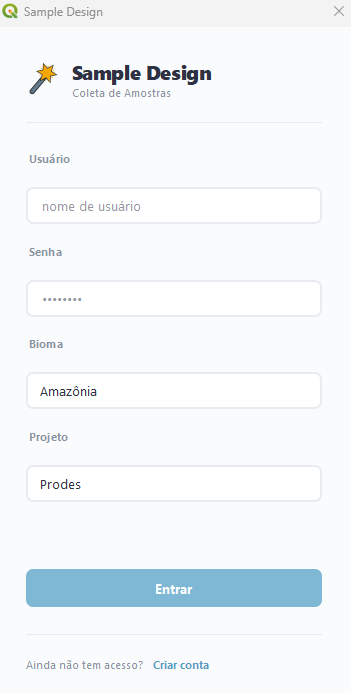
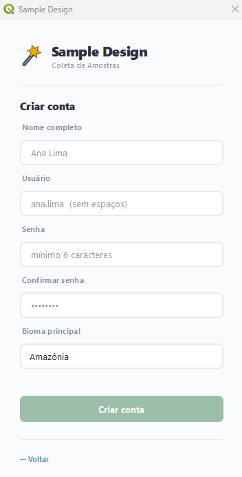

2. "Entre" com um usuário já cadastrado. Caso ainda não possua acesso, clique em "Criar conta" e realize o cadastro.

3. Após o login, será aberta uma camada com o padrão:

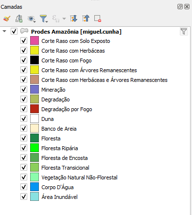

`[Projeto] [Bioma] [Usuário]`

Exemplo: Prodes Amazônia [miguel.cunha]

Importante: utilize sempre essa camada para edição, pois ela está conectada diretamente ao banco de dados.

## Funcionalidades do Plugin

### Ferramentas de Desenho

1. Selecione uma das ferramentas de desenho disponíveis:
   - Quadrado pré-definido (10 px) ou Polígono livre.
2. Utilize escala máxima de 1:10.000 para realizar edição das amostras.

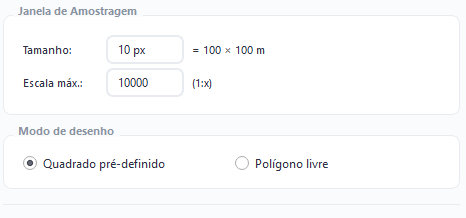

### Contagem de Amostras

3. Contagem de Amostras:
   - O sistema apresenta dois tipos de contagem:
     - **Sessão**: exibe a quantidade de amostras criadas durante a sessão atual.
       - Filtros disponíveis: Tile, Ecorregião.
     - **Totais**: exibe a quantidade total de amostras armazenadas no banco de dados.
       - Filtros disponíveis: Tile, Ecorregião, Usuário.

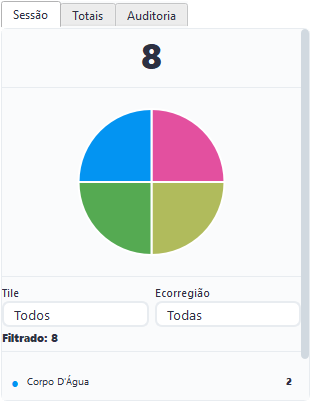
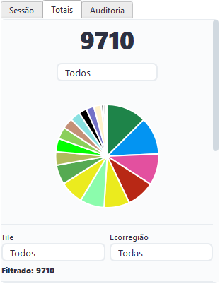

### Relatório

4. Relatório:
   1. Botão de "Gerar Relatório" para obter os quantitativos totais registrados no banco de dados.

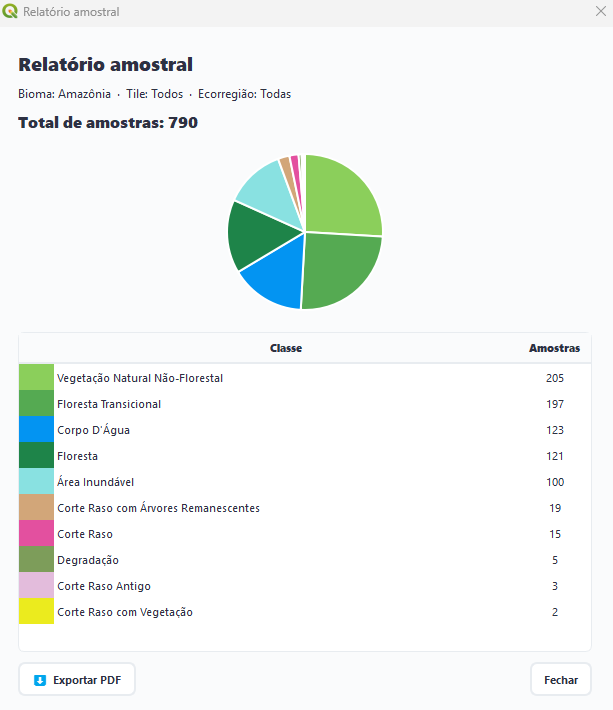

### Ferramentas de Edição

5. Ferramentas de Edição

#### Botão "Desfazer"

Remove a última alteração realizada.

#### Botão "Refazer"

Restaura a última alteração desfeita.

Ambas as alterações são aplicadas diretamente no banco de dados e na tabela de atributos.

- Botão "Atualizar Mapa": Atualiza a visualização do mapa e carrega os dados mais recentes retornados pelo banco de dados.

## Perfil Administrador

6. Botão "Gerenciar Usuários":

Permite: Conceder ou remover permissão de Administrador e de Auditor.

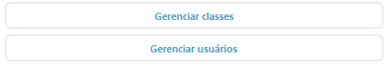

## Perfil Auditor

Permissões disponíveis: Adicionar, Excluir e Reclassificar amostras.

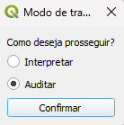

### 7. Botão "Reclass"

- Clique na ferramenta "Selecionar Feições":

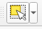

- Selecione uma feição desejada no mapa.
- Escolha a nova classe na lista de classes.
- Clique no botão "Reclass (Auditoria)".

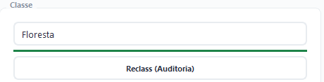

- Confirme a alteração.

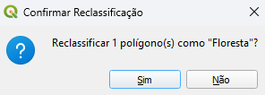

## Sair

8. Botão "Sair" para Encerrar Sessão.

- Clique em Sair para finalizar o acesso ao sistema. A camada de amostras será salva automaticamente.

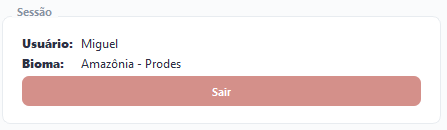

---

# Manual de Uso do Plugin Home Office com WFS

## 1. Crie uma Conexão com o Geopackage

1. Crie uma conexão com o Geopackage:
   - Baixe o [geopackage](https://terrabrasilis.dpi.inpe.br/rawdata/PRODES_AUTO/AMZ/AMOSTRAGEM/geopackage_amazonia/prodes_amz_amostras.zip)
   - Descompacte o zip
   - Clicar com botão direito em cima de Geopackage no navegador → Nova Conexão → projeto_bioma_amostras.gpkg

Exemplos: prodes_amz_amostras.gpkg, vs_ptn_amostras.gpkg, etc.

## 2. Abra o Projeto do QGIS

2. Abra o projeto do QGIS "amazonia" contido no arquivo:

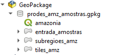

Feito isso, irá abrir todas as camadas dentro do gpkg: tiles_amz e subregioes_amz. Essas camadas serão utilizadas para fazer a intersecção por tile e ecorregião nas colunas respectivas.

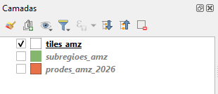

Clique duas vezes sobre a camada no WFS para adicioná-la ao seu projeto.

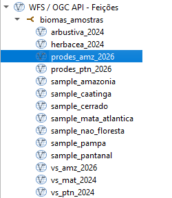

## 3. Abra o Plugin

3. Abra o Plugin.

## 4. Abrir Geopackage pelo Plugin

4. Clique em "Abrir Geopackage" pelo plugin.

## 5. Localizar o Geopackage

5. Procure pela geopackage "prodes_amz_amostras.gpkg" localmente na sua máquina.

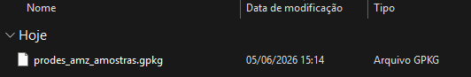

Irá abrir "entrada_amostras" como camada de edição.

## 6. Nome do Analista

6. Informe o Nome do Analista.

- Utilize o mesmo nome de usuário cadastrado (nome.sobrenome) no banco de dados.

## 7. Selecione o Bioma

7. Selecione o Bioma.

## 8. Selecione o Projeto

8. Selecione o Projeto.

**Importante:** utilize sempre a camada **"entrada_amostras"** do arquivo prodes_amz_amostras para editar a coleta, pois ela contém as colunas e os atributos necessários para garantir a compatibilidade com a camada armazenada no banco de dados, permitindo a execução correta do processo via WFS.

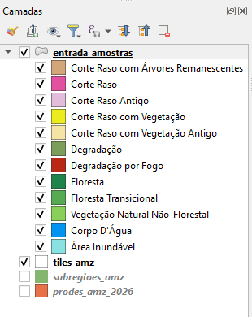

**DICA:** Filtre as camadas pelo Tile que está interpretando para deixar o arquivo mais leve.

## Funcionalidades do Plugin

### Ferramentas de Desenho

9. Selecione uma das ferramentas de desenho disponíveis:
   - Quadrado pré-definido (10 px) ou Polígono livre.
10. Utilize escala máxima de 1:10.000 para realizar a interpretação e edição das amostras.

### Contagem de Amostras

11. Contagem de Amostras:

O sistema apresenta um tipo de contagem:

- **Sessão**: Exibe a quantidade de amostras criadas durante a sessão atual.

Filtros disponíveis: Tile, Ecorregião.

### Relatório

12. Relatório:
    - Clique em Gerar Relatório para obter os quantitativos totais registrados no banco de dados.

### Ferramentas de Edição

13. Ferramentas de Edição

#### Desfazer

Remove a última alteração realizada.

#### Refazer

Restaura a última alteração desfeita.

Ambas as modificações são aplicadas diretamente no Geopackage e na tabela de atributos.

## Exportação para WFS

14. Exportação para WFS

#### Botão "Exportar para WFS"

Utilize esta opção quando desejar exportar a coleta do home-office para o banco de dados.

Procedimento:

- Selecione a Camada WFS de Destino: prodes_amz_2026 (carregada a partir do WFS).
- Selecione a Camada de Entrada: sempre essa entrada_amostras (camada de edição).
- Informe o Tile trabalhado.
- Clique em Executar.

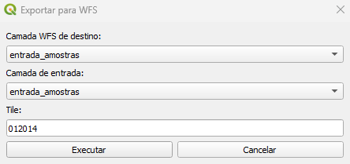
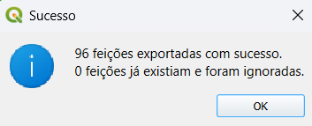

Durante a exportação é realizada automaticamente uma operação de diferença espacial entre os dados locais e os dados já existentes no banco.

Importante:

- Amostras duplicadas são descartadas automaticamente.
- Apenas feições novas são enviadas para o banco de dados.
- Após a exportação, o analista pode continuar trabalhando normalmente na mesma camada local de amostras.

## Fechar Geopackage

15. Fechar Geopackage:

Ao finalizar as atividades:

- "Fechar Geopackage" e a camada de amostras será salva automaticamente.
- Encerre a sessão.

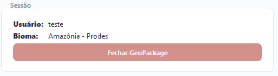
